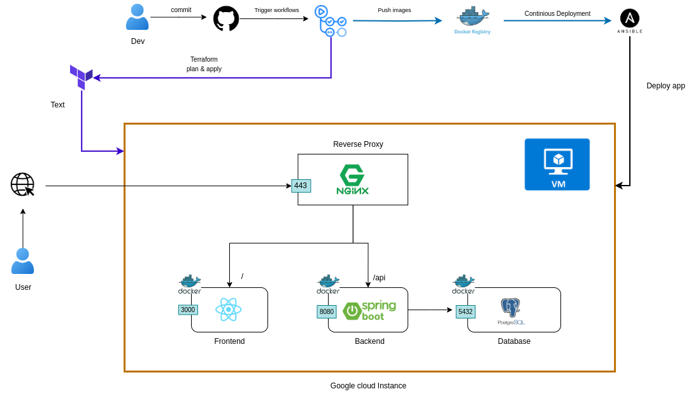
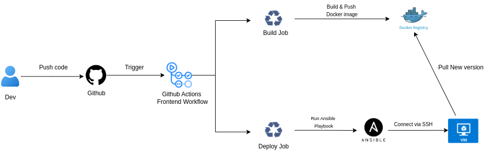

# Full-Stack Application CI/CD Pipeline

This repository provides an end-to-end CI/CD pipeline for deploying a Full-Stack application. The pipeline leverages **Terraform** for infrastructure provisioning, **Ansible** for configuration management, and **GitHub Actions** for continuous integration and deployment.

## Overview

This full stack application utilizes a Full-Stack architecture comprising:

1. **Frontend Tier:** Built with [React](https://reactjs.org), it manages user interactions and delivers a dynamic user interface.
2. **Backend Tier:** Powered by [Spring Boot](https://spring.io/projects/spring-boot), it processes business logic and handles client requests.
3. **Data Tier:** Utilizes [PostgreSQL](https://www.postgresql.org) for robust and efficient data storage and retrieval.

This clear separation enhances scalability, maintainability, and flexibility, ensuring a robust and performant application.

## Components

- **Terraform**: Defines and provisions the infrastructure required for the application ([Terraform Official](https://www.terraform.io)).
- **Ansible**: Automates configuration of virtual machines to ensure consistent environments.
- **GitHub Actions**: Automates the build, test, and deployment processes as part of the CI/CD pipeline ([GitHub Actions Docs](https://docs.github.com/en/actions)).

## Repository Structure

- **`.github/workflows/`**: Contains the CI/CD workflow definitions.
- **`e-wallet/`**: Source code for the Full-Stack application.
- **`infra/`**: Terraform scripts for infrastructure setup.
- **`docker-compose.prod.yml`**: Docker Compose configuration for production deployment.
- **`nginx.conf`**: NGINX configuration for reverse proxy.

## Architecture

The diagram below illustrates the overall CI/CD pipeline and Full-Stack application architecture:

## Frontend Workflow

The following diagram demonstrates an example of the frontend workflow:

